# Conquest Server - Class Architecture

This diagram shows the class structure following the "Thin Controller, Fat Service" pattern.

## Class Diagram

```mermaid
---
title: Conquest Server - Class Architecture
---
classDiagram
    %% ==========================================
    %% CONTROLLERS (Thin - HTTP concerns only)
    %% ==========================================
    
    class AuthController {
        -IAuthService _authService
        +Task~ActionResult~AuthResponse~~ Register(RegisterDto)
        +Task~ActionResult~AuthResponse~~ Login(LoginDto)
        +Task~ActionResult~UserDto~~ GetCurrentUser()
        +Task~IActionResult~ ForgotPassword(ForgotPasswordDto)
        +Task~IActionResult~ ResetPassword(ResetPasswordDto)
        +Task~IActionResult~ ChangePassword(ChangePasswordDto)
    }
    
    class PlacesController {
        -IPlaceService _placeService
        +Task~ActionResult~PlaceDetailsDto~~ CreatePlace(UpsertPlaceDto)
        +Task~ActionResult~PlaceDetailsDto~~ GetPlaceById(int id)
        +Task~ActionResult~IEnumerable~PlaceDetailsDto~~~ SearchNearby(query params)
    }
    
    class EventsController {
        -IEventService _eventService
        +Task~ActionResult~EventDto~~ CreateEvent(CreateEventDto)
        +Task~ActionResult~EventDto~~ GetEventById(int id)
        +Task~ActionResult~IEnumerable~EventDto~~~ GetMyEvents()
        +Task~ActionResult~IEnumerable~EventDto~~~ GetEventsAttending()
        +Task~ActionResult~IEnumerable~EventDto~~~ GetPublicEvents(query params)
        +Task~IActionResult~ JoinEvent(int id)
        +Task~IActionResult~ LeaveEvent(int id)
        +Task~IActionResult~ DeleteEvent(int id)
        +Task~IActionResult~ UpdateEvent(int id, UpdateEventDto)
    }
    
    class ActivitiesController {
        -IActivityService _activityService
        +Task~ActionResult~ActivityDetailsDto~~ CreateActivity(CreateActivityDto)
    }
    
    class ActivityKindsController {
        -AppDbContext _context
        +Task~ActionResult~IEnumerable~ActivityKindDto~~~ GetActivityKinds()
        +Task~ActionResult~ActivityKindDto~~ CreateActivityKind(CreateActivityKindDto)
        +Task~IActionResult~ DeleteActivityKind(int id)
    }
    
    class FriendsController {
        -IFriendService _friendService
        +Task~ActionResult~IEnumerable~FriendSummaryDto~~~ GetMyFriends()
        +Task~IActionResult~ AddFriend(string username)
        +Task~IActionResult~ AcceptFriend(string username)
        +Task~ActionResult~IEnumerable~FriendSummaryDto~~~ GetIncomingRequests()
        +Task~IActionResult~ RemoveFriend(string username)
    }
    
    class ProfilesController {
        -IProfileService _profileService
        +Task~ActionResult~PersonalProfileDto~~ GetMyProfile()
        +Task~ActionResult~IEnumerable~ProfileDto~~~ SearchProfiles(string username)
    }
    
    class ReviewsController {
        -IReviewService _reviewService
        -IFriendService _friendService
        +Task~ActionResult~ReviewDto~~ CreateReview(int placeActivityId, CreateReviewDto)
        +Task~ActionResult~IEnumerable~ReviewDto~~~ GetReviews(int placeActivityId, string scope)
    }
    
    %% ==========================================
    %% SERVICES (Fat - Business logic & data access)
    %% ==========================================
    
    class IAuthService {
        <<interface>>
        +Task~AuthResponse~ RegisterAsync(RegisterDto)
        +Task~AuthResponse~ LoginAsync(LoginDto)
        +Task~UserDto?~ GetCurrentUserAsync(string userId)
        +Task~string?~ ForgotPasswordAsync(ForgotPasswordDto, scheme, host)
        +Task~bool~ ResetPasswordAsync(ResetPasswordDto)
        +Task~bool~ ChangePasswordAsync(string userId, ChangePasswordDto)
    }
    
    class AuthService {
        -UserManager~AppUser~ _userManager
        -SignInManager~AppUser~ _signInManager
        -ITokenService _tokenService
        +Task~AuthResponse~ RegisterAsync(RegisterDto)
        +Task~AuthResponse~ LoginAsync(LoginDto)
        +Task~UserDto?~ GetCurrentUserAsync(string userId)
        +Task~string?~ ForgotPasswordAsync(ForgotPasswordDto, scheme, host)
        +Task~bool~ ResetPasswordAsync(ResetPasswordDto)
        +Task~bool~ ChangePasswordAsync(string userId, ChangePasswordDto)
    }
    
    class ITokenService {
        <<interface>>
        +Task~AuthResponse~ CreateAuthResponseAsync(AppUser user)
    }
    
    class TokenService {
        -UserManager~AppUser~ _userManager
        -JwtOptions _jwtOptions
        +Task~AuthResponse~ CreateAuthResponseAsync(AppUser user)
        -string CreateToken(AppUser, IList~string~ roles)
    }
    
    class IPlaceService {
        <<interface>>
        +Task~PlaceDetailsDto~ CreatePlaceAsync(UpsertPlaceDto, userId)
        +Task~PlaceDetailsDto?~ GetPlaceByIdAsync(int id, userId)
        +Task~IEnumerable~PlaceDetailsDto~~ SearchNearbyAsync(lat, lng, radiusKm, userId)
    }
    
    class PlaceService {
        -AppDbContext _context
        -IRedisService _redisService
        -IConfiguration _config
        +Task~PlaceDetailsDto~ CreatePlaceAsync(UpsertPlaceDto, userId)
        +Task~PlaceDetailsDto?~ GetPlaceByIdAsync(int id, userId)
        +Task~IEnumerable~PlaceDetailsDto~~ SearchNearbyAsync(lat, lng, radiusKm, userId)
        -double CalculateDistance(lat1, lng1, lat2, lng2)
    }
    
    class IEventService {
        <<interface>>
        +Task~EventDto~ CreateEventAsync(CreateEventDto, userId)
        +Task~EventDto?~ GetEventByIdAsync(int id)
        +Task~IEnumerable~EventDto~~ GetMyEventsAsync(userId)
        +Task~IEnumerable~EventDto~~ GetEventsAttendingAsync(userId)
        +Task~IEnumerable~EventDto~~ GetPublicEventsAsync(minLat, maxLat, minLng, maxLng)
        +Task~bool~ DeleteEventAsync(int id, userId)
        +Task~bool~ JoinEventAsync(int id, userId)
        +Task~bool~ LeaveEventAsync(int id, userId)
    }
    
    class EventService {
        -AppDbContext _context
        -AuthDbContext _authContext
        +Task~EventDto~ CreateEventAsync(CreateEventDto, userId)
        +Task~EventDto?~ GetEventByIdAsync(int id)
        +Task~IEnumerable~EventDto~~ GetMyEventsAsync(userId)
        +Task~IEnumerable~EventDto~~ GetEventsAttendingAsync(userId)
        +Task~IEnumerable~EventDto~~ GetPublicEventsAsync(minLat, maxLat, minLng, maxLng)
        +Task~bool~ DeleteEventAsync(int id, userId)
        +Task~bool~ JoinEventAsync(int id, userId)
        +Task~bool~ LeaveEventAsync(int id, userId)
    }
    
    class EventMapper {
        <<static>>
        +EventDto MapToDto(Event, Dictionary~string,AppUser~, userId)
        +EventDto MapToDto(Event, AppUser creator, List~AppUser~ attendees, userId)
    }
    
    class IActivityService {
        <<interface>>
        +Task~ActivityDetailsDto~ CreateActivityAsync(CreateActivityDto)
    }
    
    class ActivityService {
        -AppDbContext _context
        +Task~ActivityDetailsDto~ CreateActivityAsync(CreateActivityDto)
    }
    
    class IReviewService {
        <<interface>>
        +Task~ReviewDto~ CreateReviewAsync(placeActivityId, CreateReviewDto, userId, userName)
        +Task~IEnumerable~ReviewDto~~ GetReviewsAsync(placeActivityId, scope, userId)
    }
    
    class ReviewService {
        -AppDbContext _context
        -IFriendService _friendService
        +Task~ReviewDto~ CreateReviewAsync(placeActivityId, CreateReviewDto, userId, userName)
        +Task~IEnumerable~ReviewDto~~ GetReviewsAsync(placeActivityId, scope, userId)
    }
    
    class IFriendService {
        <<interface>>
        +Task~List~string~~ GetFriendIdsAsync(userId)
        +Task~IEnumerable~FriendSummaryDto~~ GetMyFriendsAsync(userId)
        +Task AddFriendAsync(userId, friendUsername)
        +Task AcceptFriendAsync(userId, friendUsername)
        +Task~IEnumerable~FriendSummaryDto~~ GetIncomingRequestsAsync(userId)
        +Task RemoveFriendAsync(userId, friendUsername)
    }
    
    class FriendService {
        -AuthDbContext _authContext
        +Task~List~string~~ GetFriendIdsAsync(userId)
        +Task~IEnumerable~FriendSummaryDto~~ GetMyFriendsAsync(userId)
        +Task AddFriendAsync(userId, friendUsername)
        +Task AcceptFriendAsync(userId, friendUsername)
        +Task~IEnumerable~FriendSummaryDto~~ GetIncomingRequestsAsync(userId)
        +Task RemoveFriendAsync(userId, friendUsername)
    }
    
    class IProfileService {
        <<interface>>
        +Task~PersonalProfileDto?~ GetMyProfileAsync(userId)
        +Task~IEnumerable~ProfileDto~~ SearchProfilesAsync(query, currentUsername)
    }
    
    class ProfileService {
        -AuthDbContext _authContext
        +Task~PersonalProfileDto?~ GetMyProfileAsync(userId)
        +Task~IEnumerable~ProfileDto~~ SearchProfilesAsync(query, currentUsername)
    }
    
    class IRedisService {
        <<interface>>
        +Task SetAsync~T~(key, value, expiry?)
        +Task~T?~ GetAsync~T~(key)
        +Task DeleteAsync(key)
        +Task~long~ IncrementAsync(key, expiry?)
        +Task~bool~ ExistsAsync(key)
        +Task~TimeSpan?~ GetTtlAsync(key)
    }
    
    class RedisService {
        -IConnectionMultiplexer _redis
        -ILogger~RedisService~ _logger
        +Task SetAsync~T~(key, value, expiry?)
        +Task~T?~ GetAsync~T~(key)
        +Task DeleteAsync(key)
        +Task~long~ IncrementAsync(key, expiry?)
        +Task~bool~ ExistsAsync(key)
        +Task~TimeSpan?~ GetTtlAsync(key)
        -IDatabase GetDatabase()
    }
    
    %% ==========================================
    %% MODELS (Domain Entities)
    %% ==========================================
    
    class AppUser {
        +string Id
        +string UserName
        +string Email
        +string FirstName
        +string LastName
        +string? ProfileImageUrl
    }
    
    class Friendship {
        +string UserId
        +string FriendId
        +FriendshipStatus Status
        +DateTime CreatedAt
        +AppUser User
        +AppUser Friend
    }
    
    class Place {
        +int Id
        +string Name
        +string? Address
        +double Latitude
        +double Longitude
        +string OwnerUserId
        +bool IsPublic
        +DateTime CreatedUtc
        +ICollection~PlaceActivity~ PlaceActivities
    }
    
    class PlaceActivity {
        +int Id
        +int PlaceId
        +int? ActivityKindId
        +string Name
        +string? Description
        +DateTime CreatedUtc
        +Place Place
        +ActivityKind? ActivityKind
        +List~Review~ Reviews
        +List~CheckIn~ CheckIns
    }
    
    class ActivityKind {
        +int Id
        +string Name
        +List~PlaceActivity~ PlaceActivities
    }
    
    class Event {
        +int Id
        +string Title
        +string? Description
        +bool IsPublic
        +DateTime StartTime
        +DateTime EndTime
        +string Location
        +string CreatedById
        +DateTime CreatedAt
        +double Latitude
        +double Longitude
        +string Status
        +List~EventAttendee~ Attendees
    }
    
    class EventAttendee {
        +int EventId
        +string UserId
        +DateTime JoinedAt
        +Event Event
    }
    
    class Review {
        +int Id
        +string UserId
        +string UserName
        +int PlaceActivityId
        +int Rating
        +string? Content
        +DateTime CreatedAt
        +PlaceActivity PlaceActivity
        +List~ReviewTag~ ReviewTags
    }
    
    class CheckIn {
        +int Id
        +string UserId
        +int PlaceActivityId
        +string? Note
        +DateTime CreatedAt
        +PlaceActivity PlaceActivity
    }
    
    class Tag {
        +int Id
        +string Name
        +int? CanonicalTagId
        +bool IsBanned
        +bool IsApproved
        +Tag? CanonicalTag
        +List~ReviewTag~ ReviewTags
    }
    
    class ReviewTag {
        +int ReviewId
        +int TagId
        +Review Review
        +Tag Tag
    }
    
    %% ==========================================
    %% DATA CONTEXTS
    %% ==========================================
    
    class AuthDbContext {
        +DbSet~AppUser~ Users
        +DbSet~Friendship~ Friendships
        #OnModelCreating(ModelBuilder)
    }
    
    class AppDbContext {
        +DbSet~Place~ Places
        +DbSet~ActivityKind~ ActivityKinds
        +DbSet~PlaceActivity~ PlaceActivities
        +DbSet~Review~ Reviews
        +DbSet~CheckIn~ CheckIns
        +DbSet~Tag~ Tags
        +DbSet~ReviewTag~ ReviewTags
        +DbSet~Event~ Events
        +DbSet~EventAttendee~ EventAttendees
        #OnModelCreating(ModelBuilder)
    }
    
    %% ==========================================
    %% MIDDLEWARE
    %% ==========================================
    
    class GlobalExceptionHandler {
        -ILogger~GlobalExceptionHandler~ _logger
        +Task~bool~ TryHandleAsync(HttpContext, Exception, CancellationToken)
    }
    
    class RateLimitMiddleware {
        -RequestDelegate _next
        -IRedisService _redis
        -IConfiguration _config
        -ILogger~RateLimitMiddleware~ _logger
        +Task InvokeAsync(HttpContext)
        -Task~bool~ CheckRateLimitAsync(clientId, limit, window)
    }
    
    %% ==========================================
    %% RELATIONSHIPS
    %% ==========================================
    
    %% Controllers → Services
    AuthController --> IAuthService : uses
    PlacesController --> IPlaceService : uses
    EventsController --> IEventService : uses
    ActivitiesController --> IActivityService : uses
    FriendsController --> IFriendService : uses
    ProfilesController --> IProfileService : uses
    ReviewsController --> IReviewService : uses
    ReviewsController --> IFriendService : uses
    
    %% Service Implementations
    IAuthService <|.. AuthService : implements
    ITokenService <|.. TokenService : implements
    IPlaceService <|.. PlaceService : implements
    IEventService <|.. EventService : implements
    IActivityService <|.. ActivityService : implements
    IReviewService <|.. ReviewService : implements
    IFriendService <|.. FriendService : implements
    IProfileService <|.. ProfileService : implements
    IRedisService <|.. RedisService : implements
    
    %% Service Dependencies
    AuthService --> ITokenService : uses
    AuthService --> AuthDbContext : uses
    PlaceService --> AppDbContext : uses
    PlaceService --> IRedisService : uses
    EventService --> AppDbContext : uses
    EventService --> AuthDbContext : uses
    EventService --> EventMapper : uses
    ActivityService --> AppDbContext : uses
    ReviewService --> AppDbContext : uses
    ReviewService --> IFriendService : uses
    FriendService --> AuthDbContext : uses
    ProfileService --> AuthDbContext : uses
    
    %% Middleware Dependencies
    RateLimitMiddleware --> IRedisService : uses
    
    %% Context → Models
    AuthDbContext --> AppUser : manages
    AuthDbContext --> Friendship : manages
    AppDbContext --> Place : manages
    AppDbContext --> PlaceActivity : manages
    AppDbContext --> ActivityKind : manages
    AppDbContext --> Event : manages
    AppDbContext --> EventAttendee : manages
    AppDbContext --> Review : manages
    AppDbContext --> CheckIn : manages
    AppDbContext --> Tag : manages
    AppDbContext --> ReviewTag : manages
    
    %% Model Relationships
    Place "1" --> "*" PlaceActivity : has
    ActivityKind "1" --> "*" PlaceActivity : categorizes
    PlaceActivity "1" --> "*" Review : has
    PlaceActivity "1" --> "*" CheckIn : has
    Review "1" --> "*" ReviewTag : has
    Tag "1" --> "*" ReviewTag : has
    Tag "0..1" --> "*" Tag : canonical
    Event "1" --> "*" EventAttendee : has
    Friendship "*" --> "1" AppUser : User
    Friendship "*" --> "1" AppUser : Friend
```

## Architecture Patterns

### Service Layer Pattern ("Thin Controller, Fat Service")
- **Controllers**: Handle HTTP concerns only (request/response, status codes, routing)
- **Services**: Contain all business logic, database queries, and domain operations
- **Benefits**:
  - Separation of concerns
  - Testability (services can be unit tested independently)
  - Reusability (business logic shared across controllers)
  - Maintainability (easier to locate and modify business rules)

### Dependency Injection
All services are registered as **Scoped** in `Program.cs`:
- `IAuthService` → `AuthService`
- `ITokenService` → `TokenService`
- `IPlaceService` → `PlaceService`
- `IEventService` → `EventService`
- `IActivityService` → `ActivityService`
- `IReviewService` → `ReviewService`
- `IFriendService` → `FriendService`
- `IProfileService` → `ProfileService`
- `IRedisService` → `RedisService` (uses singleton `IConnectionMultiplexer`)

### Repository Pattern (via DbContext)
- `AuthDbContext` and `AppDbContext` serve as repositories
- Services inject contexts directly for data access
- No separate repository layer (EF Core already provides abstraction)

### DTO Pattern
- Controllers accept and return DTOs only
- Services handle conversion between entities and DTOs
- Prevents overposting and underposting vulnerabilities
- Enforces contract versioning

## Key Design Decisions

1. **Database Separation**: Auth and App concerns stored in separate SQLite databases for modularity
2. **Cross-Database References**: String-based FKs (AppUser.Id) used from AppDb → AuthDb (validated at app layer)
3. **Redis Integration**: Distributed caching and rate limiting for scalability
4. **Global Exception Handling**: Standardized error responses via middleware
5. **JWT Authentication**: Stateless token-based auth with configurable expiration
6. **Geospatial Queries**: Bounding box + Haversine distance calculation (future: spatial indexes)
7. **N+1 Prevention**: Batch user loading in EventService using `ToDictionary` pattern
