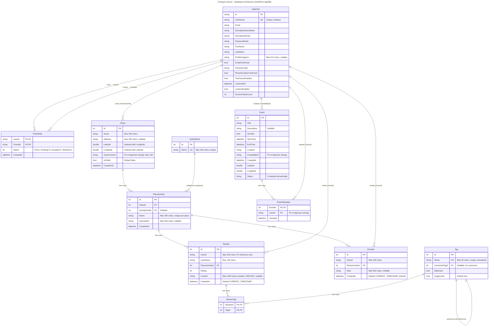

# Conquest Server - Database Architecture

This diagram shows the two separate SQLite databases used in the Conquest server application.

## Database ER Diagram

## Database Separation Notes

### AuthDbContext (Identity & Social)
- **Purpose**: Authentication, authorization, and social relationships
- **File**: `Data/Auth/AuthDbContext.cs`
- **Connection**: `AuthConnection` in appsettings.json
- **Tables**:
  - AspNetUsers (AppUser) - Extended Identity user
  - AspNetRoles, AspNetUserRoles, AspNetUserClaims, etc. (Identity tables)
  - Friendships - Bidirectional social connections
- **Indexes**:
  - Unique index on AppUser.UserName

### AppDbContext (Domain)
- **Purpose**: Core application domain (places, activities, events, reviews)
- **File**: `Data/App/AppDbContext.cs`
- **Connection**: `AppConnection` in appsettings.json
- **Indexes**:
  - `(Latitude, Longitude)` on Place - Geospatial bounding box queries
  - Unique `Name` on ActivityKind
  - Unique `(PlaceId, Name)` on PlaceActivity
  - `(PlaceActivityId, UserId)` on Review
  - Unique `Name` on Tag
  - `(PlaceActivityId, CreatedAt)` on CheckIn - Time-based queries
- **Seed Data**:
  - 8 predefined ActivityKinds (Soccer, Climbing, Tennis, Hiking, Running, Photography, Coffee, Gym)

## Cascade Delete Behaviors

| Relationship | Delete Behavior | Reason |
|--------------|-----------------|--------|
| Friendship → User/Friend | **Restrict** | Prevent accidental user deletion with active friendships |
| PlaceActivity → Place | **Cascade** | Remove activities when place is deleted |
| PlaceActivity → ActivityKind | **Restrict** | Prevent deletion of kinds in use |
| Review → PlaceActivity | **Cascade** | Remove reviews when activity is deleted |
| CheckIn → PlaceActivity | **Cascade** | Remove check-ins when activity is deleted |
| ReviewTag → Review | **Cascade** | Remove tags when review is deleted |
| ReviewTag → Tag | **Cascade** | Clean up join table |
| EventAttendee → Event | **Cascade** | Remove attendees when event is deleted |

## Cross-Database References

The application uses **string-based foreign keys** to reference AppUser from the App database:
- `Place.OwnerUserId` → AppUser.Id
- `Review.UserId` → AppUser.Id (denormalized with UserName)
- `CheckIn.UserId` → AppUser.Id
- `Event.CreatedById` → AppUser.Id
- `EventAttendee.UserId` → AppUser.Id

These are **not enforced by database foreign key constraints** due to the separation of contexts, but are validated at the application layer.
